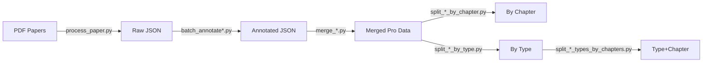

# Bihar 10th PYQs - Question Paper Processing System

A comprehensive Python-based pipeline for downloading, processing, annotating, and organizing Class 10 question papers from Bihar Board (2009–2025).

## 📊 Data Pipeline Overview



---

## 📁 Folder Structure

| Folder | Contents |
|--------|----------|
| `{subject}_papers/` | Downloaded PDF question papers |
| `{subject}_data/` | Raw extracted JSON (no annotations) |
| `{subject}_data_annotated/` | JSON with chapter/topic metadata |
| `{subject}_pro/` | Merged file: all years combined |
| `{subject}_pro_chapters/` | Split by chapter |
| `{subject}_pro_types/` | Split by question type |
| `{subject}_pro_type_chapters/` | Split by type, then by chapter |

---

## 📚 Class 10 Subjects

Bihar Board Class 10 covers the following subjects:
- **Science** (Physics, Chemistry, Biology combined)
- **Mathematics**
- **Social Science** (History, Geography, Political Science, Economics)
- **Hindi** (First Language)
- **English** (Second Language)
- **Sanskrit** (Optional)

---

## 🔧 Prerequisites

```bash
pip install google-generativeai pandas xlsxwriter requests groq python-dotenv
```

Set your API keys in a `.env` file in the root directory:
```text
GOOGLE_API_KEY=your-google-api-key-here
GROQ_API_KEY=your-groq-api-key-here
```

---

## 🚀 Getting Started

1. Place your Class 10 question paper PDFs in the appropriate `{subject}_papers/` folder
2. Run the processing scripts (to be adapted from Class 12 pipeline)
3. Follow the same annotation, merge, and split workflow

---

## 📝 Notes

This project structure mirrors the Bihar 12th PYQs project. Scripts will be adapted for Class 10 syllabus and subjects.

---

## 📅 TODO

- [ ] Create subject-specific folders (science, mathematics, social_science, hindi, english, sanskrit)
- [ ] Adapt processing scripts for Class 10 paper format
- [ ] Create Class 10 chapter lists for each subject
- [ ] Download available question papers
- [ ] Process and annotate questions
