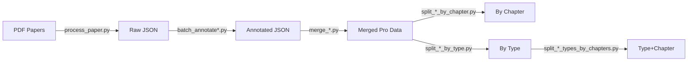

# Bihar 10th PYQs - Question Paper Processing System

A comprehensive Python-based pipeline for extracting, annotating, and organizing Class 10 Previous Year Question (PYQs) papers from the Bihar Board (BSEB).

## 📊 Data Pipeline Overview



---

## 📁 Folder Structure

| Folder | Contents |
|--------|----------|
| `{subject}_papers/` | Downloaded PDF question papers |
| `{subject}_data/` | Raw extracted JSON (no annotations) |
| `{subject}_data_annotated/` | JSON with chapter metadata from Gemini |
| `{subject}_pro/` | Merged file: all years combined |
| `{subject}_pro_chapters/` | Data split by individual chapters |
| `{subject}_pro_types/` | Data split by question type (Objective/Short/Long) |
| `{subject}_pro_type_chapters/` | Categorized by type and then by chapter |

---

## 📚 Class 10 Subjects Covered

The pipeline supports the following subjects with official Bihar Board chapter mappings:
- **Science** (NCERT)
- **Mathematics** (NCERT)
- **Social Science** (NCERT)
- **Hindi** (Godhuli Bhag 2, Varnika Bhag 2)
- **English** (Panorama Part 2, Panorama English Reader)
- **Sanskrit** (Piyusham Bhag 2, Piyusham Drutpathay)

---

## 🛠️ Scripts & Usage

### 1. Extraction
- `process_paper.py`: Core engine using Gemini to extract structured JSON from PDFs.
- `batch_processing_{subject}.py`: Automates extraction for multiple years of a specific subject.

### 2. Annotation
- `batch_annotate_{subject}.py`: Uses Gemini to map questions to specific NCERT chapters based on predefined Class 10 syllabi.

### 3. Processing & Organization
- `merge_{subject}.py`: Combines all annual JSON files into a single master "Pro" file.
- `split_{subject}_by_chapter.py`: Splits the data into individual chapter files.
- `split_{subject}_by_type.py`: Groups questions into Objective, Short Answer, and Long Answer categories.
- `split_{subject}_types_by_chapters.py`: Provides the most granular organization (e.g., all "Short Answer" questions for "Real Numbers").

---

## ⚡ Parallel Processing

All batch processing scripts now support **parallel execution** using Python's `ThreadPoolExecutor` for significantly faster processing.

### Features:
- **4 concurrent workers** by default (configurable via `MAX_WORKERS`)
- **Thread-safe console output** for clean progress tracking
- **Automatic skip** for already processed files
- **Comprehensive summary** with success/failure counts and timing stats

### Example Output:
```
============================================================
📚 Processing 4 papers with 4 parallel workers
============================================================

🚀 Starting: sci_2022ii.pdf
🚀 Starting: sci_2021i.pdf
🚀 Starting: sci_2014i.pdf
🚀 Starting: sci_2011i.pdf
✅ Completed: sci_2011i.pdf
⏱️  Time for sci_2011i.pdf: 62.44s (1.04min)
✅ Completed: sci_2014i.pdf
⏱️  Time for sci_2014i.pdf: 120.41s (2.01min)
...

============================================================
📊 SUMMARY
============================================================
✅ Successful: 4
❌ Failed: 0
⏱️  Total time: 158.08s (2.63min)
📈 Average time per paper: 120.23s
```

---

## 🔧 Installation & Setup

```bash
pip install google-generativeai pandas xlsxwriter requests groq python-dotenv
```

### Environment Configuration
Create a `.env` file in the root directory:
```text
GOOGLE_API_KEY=your_google_api_key
```

---

## 🚀 Getting Started

1. **Prepare PDFs**: Place your question paper PDFs in `{subject}_papers/` (e.g., `science_papers/science_2024.pdf`).
2. **Batch Process**: Run `python batch_processing_science.py` to extract raw data.
3. **Annotate**: Run `python batch_annotate_science.py` to add chapter metadata.
4. **Finalize**: Run the merge and split scripts to generate your organized data sets.

---

## 📝 Status
- ✅ Project Structure Initialized
- ✅ Folder structure created for 6 subjects
- ✅ Core Extraction Logic (Gemini)
- ✅ Batch Processing Scripts for all subjects
- ✅ **Parallel Processing** with 4 concurrent workers
- ✅ NCERT Class 10 Chapter Mappings for all subjects
- ✅ Annotation, Merge, and Split Pipeline Scripts
- ✅ Science data extraction complete (26 PDFs → 26 JSONs)
