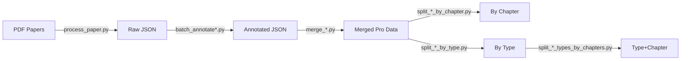

# Bihar 10th PYQs - Question Paper Processing System

A comprehensive Python-based pipeline for extracting, annotating, and organizing Class 10 Previous Year Question (PYQs) papers from the Bihar Board (BSEB).

## 📊 Data Pipeline Overview


```mermaid
flowchart LR
    A[PDF Papers] -->|process_paper.py| B[Raw JSON]
    B -->|batch_annotate*.py| C[Annotated JSON]
    C -->|merge_*.py| D[Merged Pro Data]
    D -->|split_*_by_chapter.py| E[By Chapter]
    D -->|split_*_by_type.py| F[By Type]
    F -->|split_*_types_by_chapters.py| G[Type+Chapter]
```

---

## 📁 Folder Structure

| Folder | Contents |
|--------|----------|
| `{subject}_papers/` | Downloaded PDF question papers |
| `{subject}_data/` | Raw extracted JSON (no annotations) |
| `{subject}_data_annotated/` | JSON with chapter metadata from Gemini |
| `{subject}_pro/` | Merged file: all years combined |
| `{subject}_pro_chapters/` | Data split by individual chapters |
| `{subject}_pro_types/` | Data split by question type (Objective/Short/Long) |
| `{subject}_pro_type_chapters/` | Categorized by type and then by chapter |

---

## 📚 Class 10 Subjects Covered

The pipeline supports the following subjects with official Bihar Board chapter mappings:
- **Science** (NCERT)
- **Mathematics** (NCERT)
- **Social Science** (NCERT)
- **Hindi** (Godhuli Bhag 2, Varnika Bhag 2)
- **English** (Panorama Part 2, Panorama English Reader)
- **Sanskrit** (Piyusham Bhag 2, Piyusham Drutpathay)

---

## 🛠️ Scripts & Usage

### 1. Extraction
- `process_paper.py`: Core engine using Gemini to extract structured JSON from PDFs.
- `batch_processing_{subject}.py`: Automates extraction for multiple years of a specific subject.

### 2. Annotation
- `batch_annotate_{subject}.py`: Uses Gemini to map questions to specific NCERT chapters based on predefined Class 10 syllabi.

### 3. Processing & Organization
- `merge_{subject}.py`: Combines all annual JSON files into a single master "Pro" file.
- `split_{subject}_by_chapter.py`: Splits the data into individual chapter files.
- `split_{subject}_by_type.py`: Groups questions into Objective, Short Answer, and Long Answer categories.
- `split_{subject}_types_by_chapters.py`: Provides the most granular organization (e.g., all "Short Answer" questions for "Real Numbers").

---

## ⚡ Parallel Processing & Robustness

All batch processing and annotation scripts support **parallel execution** with enhanced robustness features.

### Advanced Features:
- **Configurable Workers**: Supports up to 20 parallel workers (4-8 recommended for API stability).
- **Staggered Launch**: Implements a 1-second delay between worker starts to prevent API rate-limit bursts.
- **Safe State Management**: Atomic `threading.Lock` for clean, non-overlapping console logs.
- **Robust Error Handling**:
    - **Raw Data Preservation**: Saves raw API responses to `*_data_raw/` before parsing.
    - **Retry Logic**: Exponential backoff for handling 429 (Rate Limit) errors.
    - **Dummy Fallback**: `dummy_annotate_all.py` allows bypassing API quotas by applying placeholder metadata ("0000").

---

## 🔧 Installation & Setup

```bash
pip install google-generativeai pandas xlsxwriter requests groq python-dotenv
```

### Environment Configuration
Create a `.env` file in the root directory:
```text
GOOGLE_API_KEY=your_google_api_key
```

---

## 🚀 Getting Started

1. **Prepare PDFs**: Place PDFs in `{subject}_papers/`.
2. **Batch Process**: Run `python batch_processing_{subject}.py` to extract raw data.
3. **Annotate**: Run `python batch_annotate_{subject}.py` (or `dummy_annotate_all.py` for placeholder data).
4. **Finalize**: Run `merge` and `split` scripts to generate organized `*_pro*` data sets.

---

## 📝 Status
- ✅ Project Structure & Folder Schema (6 Subjects)
- ✅ Core Extraction Engine (Gemini 1.5/2.0/3.0 Ready)
- ✅ **Staggered Parallel Processing** (Worker-safe)
- ✅ **Robust API Logging** (Raw response saving)
- ✅ NCERT Class 10 Chapter Mappings (All Subjects)
- ✅ **Dummy Annotation Support** (Quota fallback)
- ✅ Full Pipeline Completion for all 6 subjects
- ✅ Final Organized Data Generation (`*_pro` folders)
