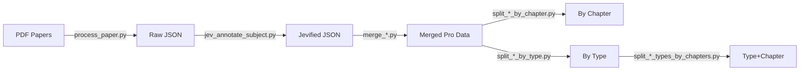

# Bihar 10th PYQs - Question Paper Processing System

A comprehensive Python-based pipeline for extracting, annotating, and organizing Class 10 Previous Year Question (PYQs) papers from the Bihar Board (BSEB), spanning from 2011 to 2026.

## 📊 Data Pipeline Overview


```mermaid
flowchart LR
    A[PDF Papers] -->|process_paper.py| B[Raw JSON]
    B -->|jev_annotate_subject.py| C[Jevified JSON]
    C -->|merge_*.py| D[Merged Pro Data]
    D -->|split_*_by_chapter.py| E[By Chapter]
    D -->|split_*_by_type.py| F[By Type]
    F -->|split_*_types_by_chapters.py| G[Type+Chapter]
```

---

## 📁 Folder Structure

| Folder | Contents |
|--------|----------|
| `{subject}_papers/` | Downloaded PDF question papers (2011-2026) |
| `{subject}_data/` | Raw extracted JSON (Questions extracted via Gemini) |
| `{subject}_data_jevified/` | High-accuracy JSON mapped to official BSEB chapters via TypeSafe AI Jev |
| `{subject}_pro/` | Merged master file: all years combined into one dictionary |
| `{subject}_pro_chapters/` | Data split by chapter (nested by section folders for multi-section subjects) |
| `{subject}_pro_types/` | Data split by question type (Objective, Short Answer, Long Answer, etc.) |
| `{subject}_pro_type_chapters/` | Categorized by type and then nested by section & chapter (with manifests) |

*(Note: Multi-section subjects like Social Science, Hindi, English, and Sanskrit nest their chapters cleanly into subdirectories by section/book: e.g. `History/`, `Geography/`, `Godhuli/`, `Varnika/`, `Panorama/`, `Panorama_Reader/`, `Piyusham/`, `Vyakaran/`).*


---

## 📚 Class 10 Subjects Covered

The pipeline supports the following subjects with complete Bihar Board chapter mappings:
- **Science** (NCERT - 16 Chapters)
- **Mathematics** (NCERT - 15 Chapters)
- **Social Science** (NCERT - 35 Chapters)
- **Hindi** (Godhuli Bhag 2, Varnika Bhag 2 - 54 Chapters)
- **English** (Panorama Part 2, Panorama English Reader - 43 Chapters)
- **Sanskrit** (Piyusham Bhag 2, Piyusham Drutpathay - 28 Chapters)

---

## 🛠️ Scripts & Usage

### 1. Extraction
- `process_{subject}_paper.py`: Core engines using Gemini 3.8/3.5/2.0 Flash to extract structured JSON from PDFs.
- `batch_processing_{subject}.py`: Automates parallel extraction for multiple years of a specific subject.

### 2. High-Accuracy Classification (Jevification)
- `jev_annotate_subject.py`: Uses TypeSafe AI's Jev model to map questions to specific NCERT/BSEB chapters with confidence scores.
- `run_jev_pipeline.py`: Master runner to classify all unclassified/newly added papers across all 6 subjects using 16 parallel workers.

### 3. Duplication Audit
- `scratch/all_pairs_audit.py`: Performs a rigorous N×N matrix comparison across all 151 papers (11,325 pairs) to detect cross-year, cross-subject, and cross-sitting duplicates. 

### 4. Processing & Organization
- `run_final_merge_split.py`: A unified master script that automatically executes all merges and splits sequentially.
- `merge_{subject}.py`: Combines all annual JSON files into a single master "Pro" file.
- `split_{subject}_by_chapter.py`: Splits the data into individual chapter files.
- `split_{subject}_by_type.py`: Groups questions into categories (e.g., Objective, Essay, Letter Writing).
- `split_{subject}_types_by_chapters.py`: Provides the most granular organization (e.g., "Short Answer" questions for "Real Numbers").

---

## ⚡ Parallel Processing & Robustness

All batch processing and annotation scripts support **parallel execution** with enhanced robustness features.

### Advanced Features:
- **Configurable Workers**: Supports up to 16 parallel workers for blazing fast Jev classification.
- **Smart Caching/Resume**: Jevification scripts automatically skip already classified files, processing only new/backlog items.
- **Safe State Management**: Atomic `threading.Lock` for clean, non-overlapping console logs.
- **Robust Error Handling**:
    - **Retry Logic**: Exponential backoff and pool rotation for handling 503/429 API errors.

---

## 🔧 Installation & Setup

```bash
pip install google-generativeai requests python-dotenv
```

### Environment Configuration
Copy `.env.example` to `.env` in the root directory and fill in your keys:

| Variable | Required for |
|----------|--------------|
| `TYPESAFE_API_KEY` | High-accuracy Jev chapter-classification pipeline (`jev_utils.py`) |
| `GOOGLE_API_KEY` | Gemini extraction/annotation in standalone mode (`utils.py`) |
| `AIza...` | Array of Gemini keys used by `gemini_pool.py` for rate-limit balancing |

> [!WARNING]
> Never hardcode API keys in source files. `.env` is gitignored — keep real keys there only.

> [!TIP]
> **API Architecture (Monorepo vs. Standalone)**
> This repository supports two modes of execution:
> 1. **Monorepo Mode**: If found inside the `gurukulam` monorepo (with `repo-management-tools` in the parent), it uses the centralized `gemini_pool.py`. This provides global concurrency control and shared rate-limiting across 10+ rotating API keys.
> 2. **Standalone Mode**: If cloned independently, it falls back to standard `google-generativeai` logic using the local `.env` key.

---

## 🚀 Getting Started

1. **Prepare PDFs**: Place PDFs in `{subject}_papers/`.
2. **Batch Extract**: Run `python batch_processing_{subject}.py` to extract raw data.
3. **Classify**: Run `python run_jev_pipeline.py` to map questions to chapters.
4. **Finalize**: Run `python run_final_merge_split.py` to generate the organized production data sets.

---

## 📝 Status
- ✅ Project Structure & Folder Schema Cleaned (6 Subjects)
- ✅ Core Extraction Engine (Gemini 3.8/3.5/2.0 Flash) Complete (2011-2026)
- ✅ High-Accuracy Jev Classification Complete (93.3% Overall Classification Rate @ >= 0.50 confidence)
- ✅ Full N×N Duplicate and Imposter Audit Completed
- ✅ Final Organized Data Generation (`*_pro` folders) Complete (151 files, 11,662 questions)
- ✅ Manual Review Web UI & Workflow (`manual_review.html` + `apply_manual_classifications.py`)

---

## 🖥️ Manual Review & Classification UI

For classifying remaining edge cases or unclassified questions:

1. **Export unclassified questions**:
   ```bash
   python export_for_review.py
   ```
   Generates `manual_review_data.json`.

2. **Open the web UI**:
   Open `manual_review.html` in any browser, and drag-and-drop `manual_review_data.json`.
   - Supports keyboard shortcuts: `↑`/`↓` navigate, `Enter` classify, `S` skip, `U` unskip.
   - Saves progress automatically to browser localStorage.
   - Click **Export Classifications** to download your decisions JSON.

3. **Apply your classifications**:
   ```bash
   python apply_manual_classifications.py manual_classifications_YYYY-MM-DD.json
   ```
   This automatically injects your manual decisions into `{subject}_data_jevified/` and rebuilds all `*_pro*` folders.

